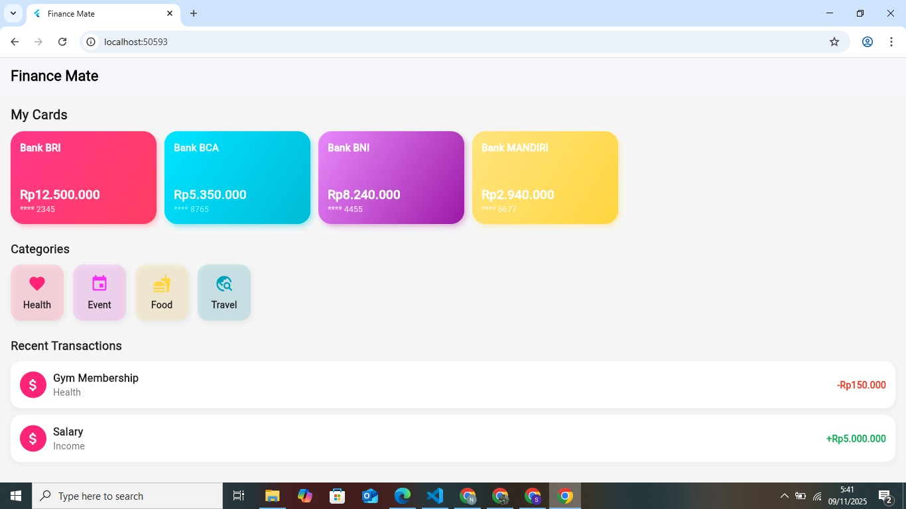

# Finance Mate

Finance Mate adalah aplikasi Flutter sederhana untuk membantu pengguna melacak keuangan pribadi — menampilkan kartu bank digital, kategori transaksi dengan ikon, serta daftar transaksi terbaru dalam desain yang modern dan responsif.

---

## Fitur Utama

✅ **Splash Screen** — Layar pembuka dengan logo aplikasi  
✅ **Home Screen** — Menampilkan:
- Kartu ATM digital (saldo, nama bank, dan nomor kartu)
- Kategori transaksi (Health, Event, Food, Travel)
- Riwayat transaksi terbaru (pemasukan & pengeluaran)

 **Widget Modular**
- `AtmCard` → Komponen kartu bank dengan warna gradasi
- `CategoryChip` → Komponen kategori dengan ikon & warna lembut
- `TransactionItem` → Item transaksi dengan keterangan dan nilai
- `GridMenuItem` → Untuk tata letak kategori yang rapi

---

## Struktur Folder

financeapp/
│
├── lib/
│ ├── main.dart
│ ├── screens/
│ │ └── home_screen.dart
│ ├── widgets/
│ │ ├── atm_card.dart
│ │ ├── category_chip.dart
│ │ ├── grid_menu_item.dart
│ │ └── transaction_item.dart
│ └── models/
│ └── transaction.dart
│
├── assets/
│ ├── images/
│ └── screenshots/
│
├── pubspec.yaml
├── README.md
└── .gitignore

---

## 📸 Tampilan Aplikasi

 | 

